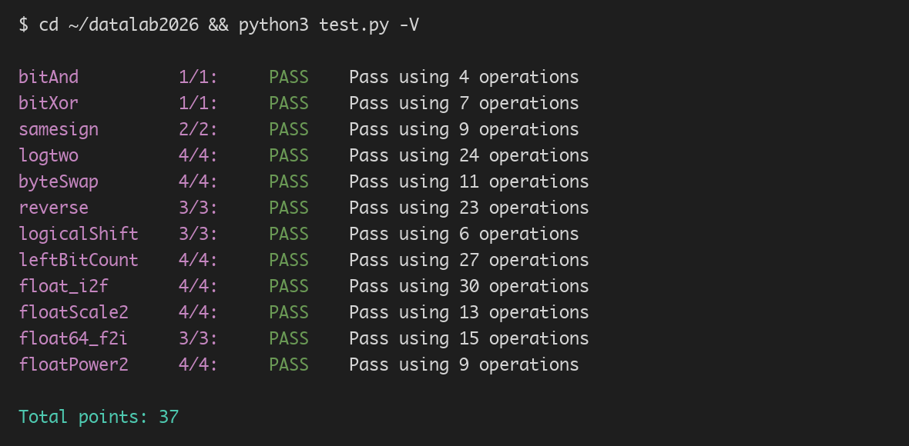

# Data Lab 报告

姓名：林泽远  
学号：2025201835

## 测试结果

| 项目 | 得分 | 操作数 |
|---|---:|---:|
| **总分** | **37/37** |  |
| bitAnd | 1/1 | 4 |
| bitXor | 1/1 | 7 |
| samesign | 2/2 | 9 |
| logtwo | 4/4 | 24 |
| byteSwap | 4/4 | 11 |
| reverse | 3/3 | 23 |
| logicalShift | 3/3 | 6 |
| leftBitCount | 4/4 | 27 |
| float_i2f | 4/4 | 30 |
| floatScale2 | 4/4 | 13 |
| float64_f2i | 3/3 | 15 |
| floatPower2 | 4/4 | 9 |



## 解题报告

### bitAnd

利用德摩根律，把按位与转换为“先取反、再或、最后取反”：

```text
x & y = ~(~x | ~y)
```

### bitXor

从“至少一者为 1”和“不能同时为 1”两个方向构造：

```text
x ^ y = ~(~x & ~y) & ~(x & y)
```

### samesign

先用算术右移取得两个数的符号位。若符号位相同，则初步结果为 `1`；再用 `!x ^ !y` 排除“一个为 0、另一个非 0”的情况。

### logtwo

使用二分方式判断最高位落在哪个区间。依次尝试 `16、8、4、2、1` 位，并把已确认的高位偏移累计到 `r` 中，最终得到以 2 为底的对数。

### byteSwap

先把两个字节分别右移并取出：

```text
byte1 = (x >> (n << 3)) & 0xFF
byte2 = (x >> (m << 3)) & 0xFF
```

它们的异或值 `diff` 中只包含两个字节不同的位，因此分别用 `diff << (n << 3)` 和 `diff << (m << 3)` 对原数执行异或，即可交换两个字节。

### reverse

按 `1、2、4、8、16` 位的粒度逐步交换相邻位组：

```text
v = ((v >> k) & mask) | ((v & mask) << k)
```

经过五轮后，原本最低位会移动到最高位，实现 32 位反转。

### logicalShift

算术右移会在高位补符号位，因此先执行正常的右移，再构造掩码清除高位补充的 `1`：

```text
mask = ~((1 << 31) >> n << 1)
```

最后将右移结果与掩码相与。

### leftBitCount

先取 `y = ~x`，问题转化为统计 `y` 开头连续 `0` 的个数。使用 `16、8、4、2、1` 五个步长做二分统计：如果当前高若干位全为 0，则累加对应位数并将 `y` 左移，跳过这些位。由于 `x = -1` 时普通统计会得到 31，最后加上 `!~x` 来补成 32。

### float_i2f

先分离符号并取得整数绝对值，然后找到最高有效位位置 `e`：

- 若 `e <= 23`，整数可以精确放入尾数，直接左移补齐 23 位。
- 若 `e > 23`，截取高位 23 位作为尾数，并计算剩余部分 `rem` 和舍入中点 `half`。

舍入采用“向偶数舍入”，条件合并为：

```text
rem >= half + !(m & 1)
```

当尾数进位到第 24 位时，将尾数清零并令指数加一。最后重新组合符号、指数和尾数。

### floatScale2

按单精度指数的三种情况处理：

1. `exp == 0xFF`：输入为 `Inf` 或 `NaN`，直接返回原值。
2. `exp == 0`：输入为 `0` 或非规格化数，使用 `uf + (uf & 0x7FFFFF)` 将尾数乘 2。
3. 其他情况：指数加一；若指数溢出则返回带原符号的无穷大，否则用掩码替换指数并保留尾数。

### float64_f2i

从高 32 位中提取符号和 11 位指数，再从两个 32 位参数中取出双精度有效数字的高 32 位：

```text
val = 0x80000000u
    | ((uf2 & 0xFFFFF) << 11)
    | (uf1 >> 21)
```

指数小于 `1023` 时向零取整为 0；指数大于 `1054` 时判定溢出。其余情况按 `1054 - exp` 右移实现向零截断，并分别检查正数和负数是否超出 32 位有符号整数范围。

### floatPower2

分四段处理指数 `x`：

- `x > 127`：超过最大规格化数，返回正无穷 `0x7F800000`。
- `x < -149`：小于最小非规格化数，返回 `0`。
- `-149 <= x <= -127`：非规格化数，返回 `1 << (x + 149)`。
- `-126 <= x <= 127`：规格化数，返回 `(x + 127) << 23`。
